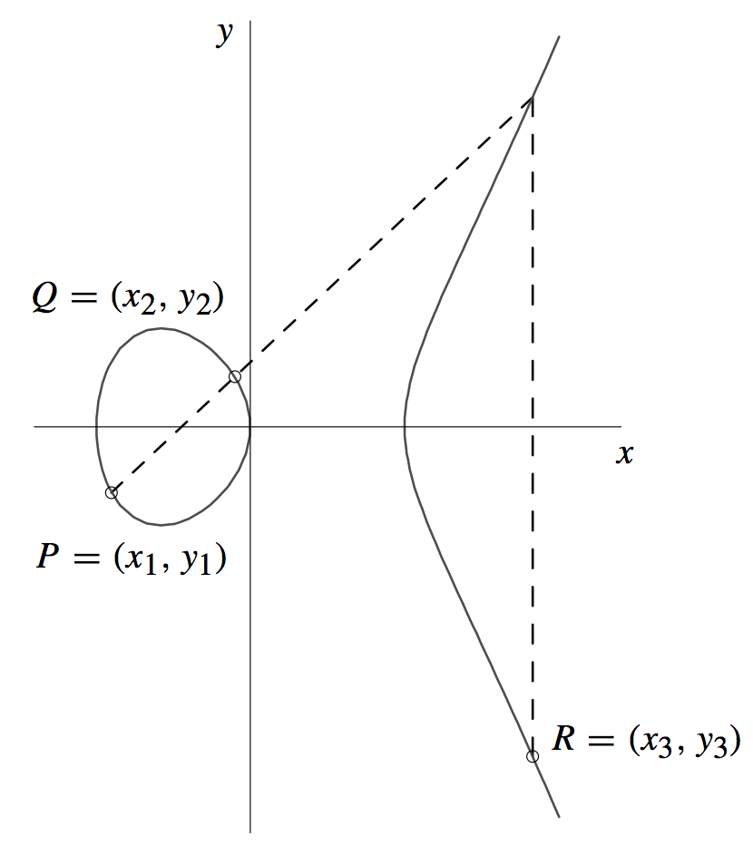
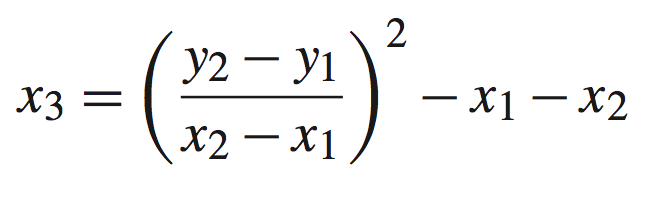
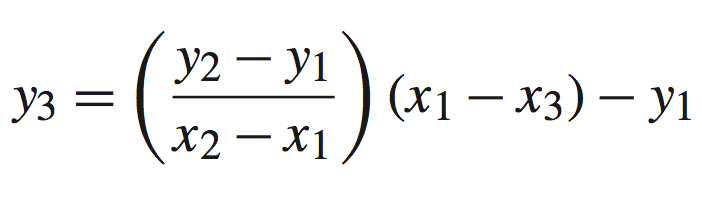
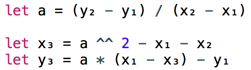
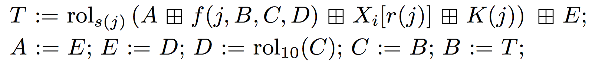
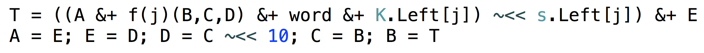

<!-- Theme: "Olive Green" Color: white -->
# Cryptocoin for Swift
### A modular framework for Bitcoin, Litecoin, Dogecoin, etc. written in Swift (and a bit of C) 


# github.com/CryptoCoinSwift

#### Work in progress. Inspired by CryptoCoinJS. 
#### Sjors Provoost  / sjors@purpledunes.com / @provoost
#### August 5th, 2014: Dutch Ethereum & Bitcoin meetup Amsterdam

^ iOs developer based in Utrecht, heard about Bitcoin in 2011, ignored it until early 2013.

---
# Why build your own framework?
* Native iPhone app
* Learn Swift
* Learn Bitcoin
* Learn elliptic curve cryptography

^ Swift is Apples new programming language.

---


^ Work in progress

---
- **UInt256** <sub>0...115792089237316195423570985008687907853269984665640564039457584007913129639935</sub>

- **FFInt** Finite field math: (6 + 6) mod 10 = 2

- **ECPoint** A = (x, y) 


- **ECurve** A + B

- **ECKey** General crypto: public key, signature..

- **CoinKey** Crypto currency specific: address, WIF..

- **Bitcoin** Subclass of CoinKey with 0x80 prefix..

<!-- - **RIPEMD-Swift, etc** Tools -->

^ Modular: several repositories deal with different layers of Bitcoin. 
ECPoint + Curve : elliptic curve cryptography forms the bases of Bitcoin security
CoinKey : e.g. generate address from public key

---
# Point addition



## The book



## Swift
<!-- ```swift
let a = (y₂ - y₁) / (x₂ - x₁)
let x₃ = a ^^ 2 - x₁ - x₂
let y₃ = a * (x₁ - x₃) - y₁
``` Unicode not showing correctly -->


<!-- ---
# Swift - Hashing example (RIPEMD-160)
## The paper


## Swift
 -->

---
# Operator overload fest
```swift
let Q = d * P // d is big number, P is a point on a curve

// Handles multiplying a big number with point on curve
func * (lhs: UInt256, rhs: ECPoint) -> ECPoint { ...
  let a = (y₂ - y₁) / (x₂ - x₁)

// Multiplication modulo (finite field)
func * (lhs: FFInt, rhs: FFInt) -> FFInt {
  let product: (UInt256, UInt256) = lhs.value * rhs.value      
  return field.int(product % p.p)
}

// Multiply two 256 bit integers:
func * (lhs: UInt256, rhs: UInt256) -> (UInt256, UInt256) { ... }
```


---
# The Future - What I need
* 4x faster
* ECDSA (signature)
* Generate a bitcoin transaction
* Submit transaction to cloud
* Fetch blockchain data from cloud

---

# The Future - For others
* Altcoins
* Different currencies like Etherium
* Blockchain & network : full client
* Mining? :-)

---
## Cryptocoin Swift
<sub>https://github.com/CryptoCoinSwift/CryptoCoinFramework</sub>

## Sources

<sub>Animating curve from CloudFlare Blog:
http://blog.cloudflare.com/a-relatively-easy-to-understand-primer-on-elliptic-curve-cryptography</sub>

<sub>Book: Guide to Elliptic Curve Cryptography - Hankerson, Menezes, Vanstone</sub>

#### Presentation written in Markdown, powered by Deckset: http://decksetapp.com

